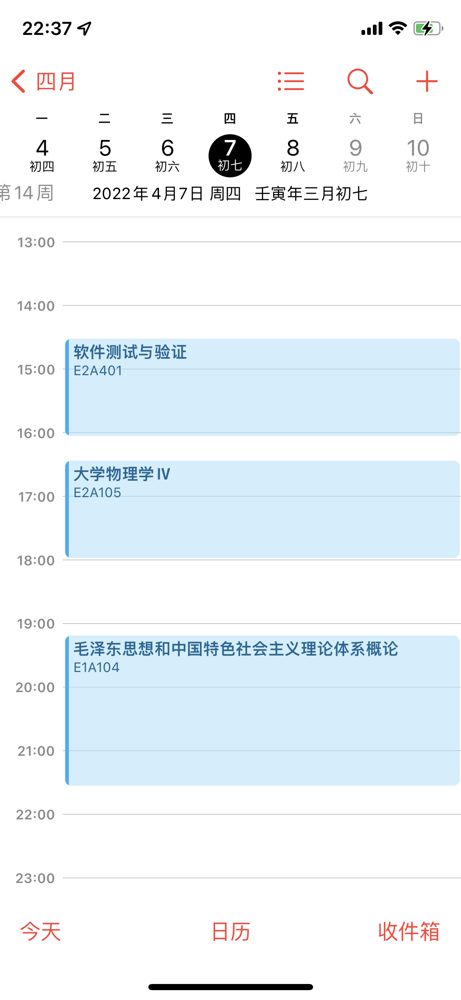
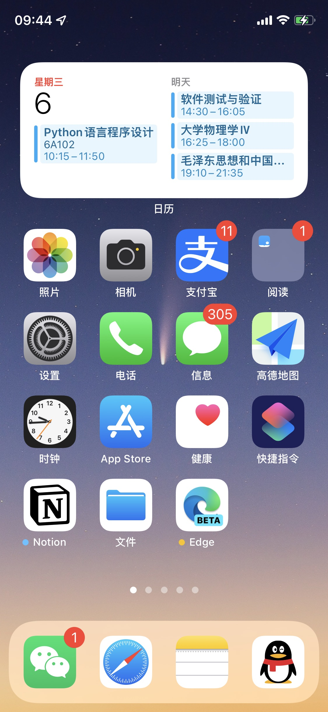
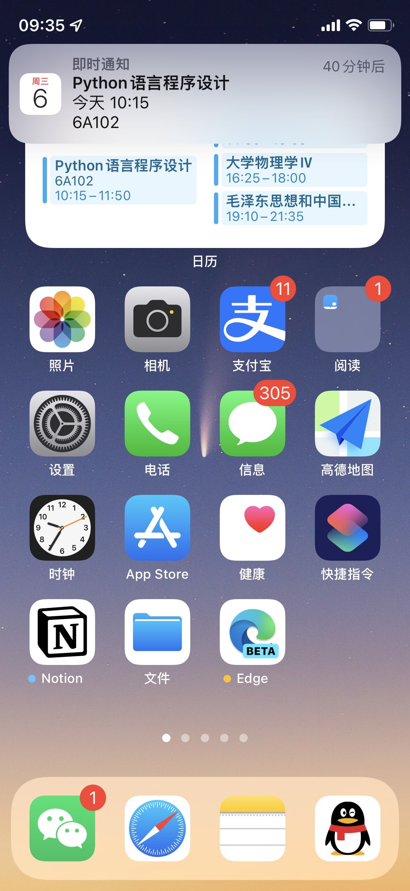
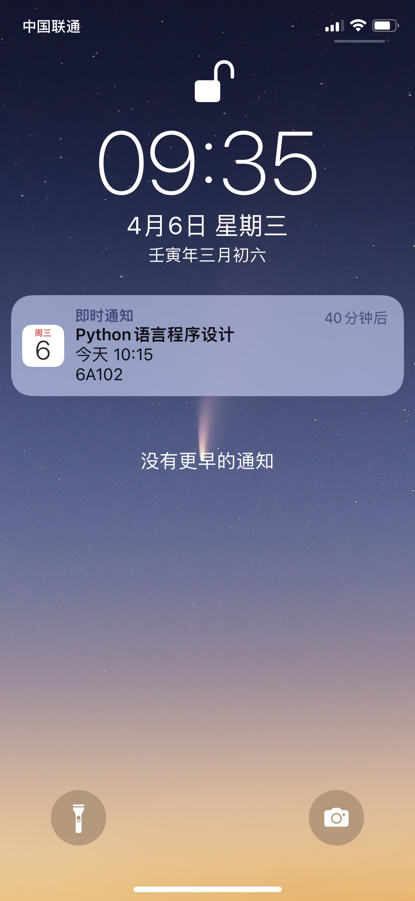

# CDUT_Calendar
能直接从 CDUT 新版教务系统导入课表进日历的工具。

## 介绍

### 截图


|  |  |
| ------------------------------------------------------------ | ------------------------------------------------------------ |
|  |  |


### 使用指北
1  克隆此项目到本地。

2  确保你的电脑已安装 Python 3+ 与 pip 包管理器。

3  在项目文件夹内运行以下命令。
```Shell
pip install -r requirements.txt
```

4  在 account.json 输入你的学号与密码。
这个密码可能与砚湖易办的不同，具体请以能以登录 https://jw.cdut.edu.cn/jsxsd/ 为准。初始密码好像是身份证后六位。

5  运行 main.py。执行以下代码：
```Shell
python main.py
```

6  导入 ics 进日历。如果不出意料，在文件夹下会生成 TimeTable.ics 文件。
使用日历打开此 ics 文件即可导入课表信息。

不同操作系统、不同日历软件导入 ics 文件的流程，请参考 **此文档** -> **额外的信息** -> **如何导入到日历？**。


### 程序运行流程

1.   获取 Cookie
     1.   预获取 Precondition Cookies 与 登录辅助 Code。
     2.   根据官网登录流程，使用辅助 Code 加密密码。
     3.   登录，获取最终 Cookie。
2.   获取课表的 HTML 表格。
3.   解析 HTML 表格，得到原始课程信息。
4.   分析原始课程信息，将其转换为含有明确开始、结束节数的列表。
5.   根据列表生成 ics 文件。


### 未来的计划

- [ ] 购买服务器并搭建日历订阅服务器（WebCal Server）。
> 日历订阅最值得关注的特性，或许是拥有自动同步日程的能力。
>
> 只需要在日历输入订阅链接，日历就能以最快的速度自动同步教务系统课程表的变更。
>
> 在下目前的构思是，服务器每隔两天从教务处获取最新课表，并更新日历订阅。得益于日历订阅的自动同步能力，在本地的日历程序即可始终同步教务系统课表的最新更改。
但即便是这样，也仍然面临一个很严肃的问题：如果想要采用日历订阅，那么在云服务器（或者云数据库）就必须至少保留用户登录的 Cookie 信息。尽管我们承诺不会对用户隐私采取任何越界行为，但


## 额外的信息

### 免责声明

此程序仅供阁下个人导出教务系统课程表的用途，禁止商用。

技术本无罪，如遇任何法律纠纷，作者对代码的行为以及可能产生的任何后果不负任何责任。


### 如何导入日历？

#### iOS/iPadOS

方法 1

使用系统自带邮件 App，发送含有 ics 文件的邮件给自己。待收到邮件后，点击 ics 即可自动导入。


方法 2

使用另一苹果设备隔空投送给当前设备。


方法 3

使用快捷指令。

// TODO


### 参考资料

1.   [RFC 5545](https://datatracker.ietf.org/doc/html/rfc5545). iCalendar 标准的官方文档。
2.   [iCalendar for Python](https://icalendar.readthedocs.io/en/latest/) 第三方库官方文档。这是能够快速生成并处理 iCalendar 对象的 Python 库。
3.   [BeautifulSoup](https://beautifulsoup.readthedocs.io/zh_CN/) 第三方库官方文档。BeautifulSoup 是一个可以从 HTML 或 XML 文件中提取数据的 Python 库。

