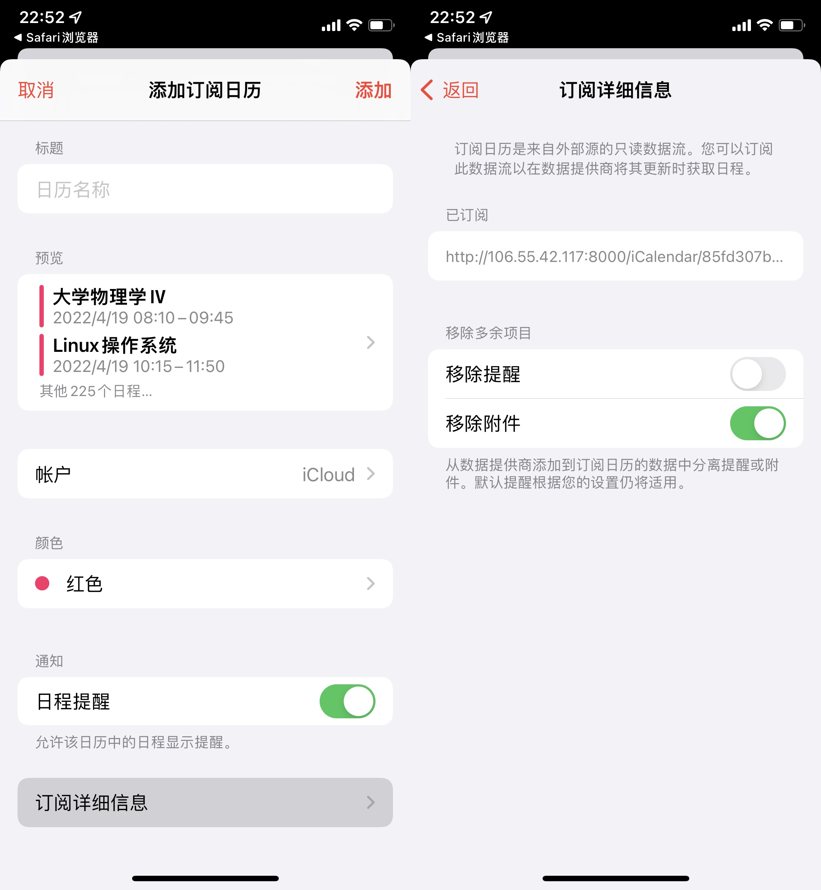
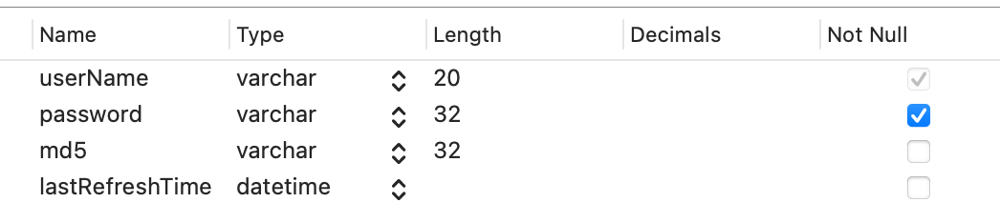
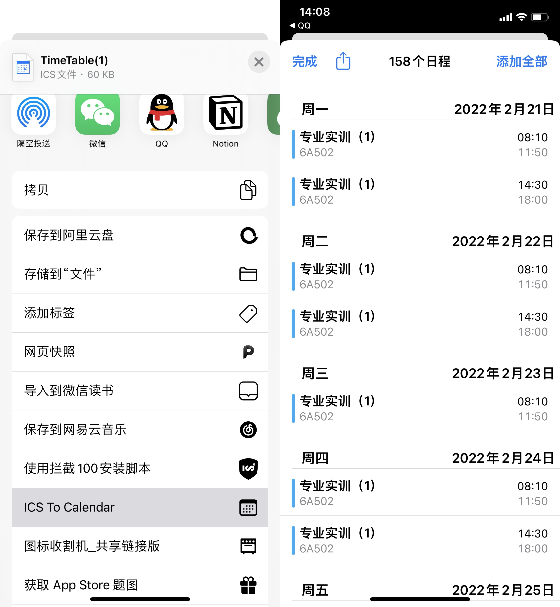

# CDUT_TimeTable

🔥 能从 CDUT 新版教务系统高效、便捷地生成订阅日历的工具。

仅需在 [此网站](https://time.pytbt.xyz) 轻轻输入你的学号与新教务处密码，不过须臾便可导入课程表订阅到日历。

请特别关注：订阅日历能每两天 **自动同步** 教务系统课程表的 **变更**。

## 介绍

### 截图


|                   |  |
| --------------------------------------------------------------------------------------------------------- | --------------------------------------------------------------------------------------------------------- |
|  |  |


### 使用指北 - 日历订阅

1.   仅需在 [此网站](https://time.pytbt.xyz) 轻轻输入你的学号与新教务处密码。

     >   ⚠️  这个密码一定不会是你的身份证后 6 位。
     >
     >   如果登录时显示密码错误，请登录 [新教务处](https://jw.cdut.edu.cn/jsxsd/)，检查密码是否正确 ✅，或者是否已经根据新教务系统的要求更改密码。初始密码为身份证后 6 位。
     >
     >   这个密码可能与砚湖易办的统一身份认证密码不同，请以能以登录 https://jw.cdut.edu.cn/jsxsd/ 为准。

2.   在接下来的响应页面复制订阅链接，或者点击「导入到日历」按钮。

3.   在日历 app 导入订阅日历。

     >   ⚠️ 请特别关注
     >
     >   iOS/iPadOS/macOS 在导入订阅日历时，请 **取消** 勾选 **订阅详细信息** -> **移除提醒**。否则将不会收到提前 30 分钟的课程信息通知。

     

     

### 使用指北 - 本地命令行

1  克隆此项目到本地。

2  确保你的电脑已安装 Python 3+ 与 pip 包管理器。

3  在项目文件夹内运行以下命令。

```Shell
pip install -r requirements.txt
```

4  在 account.json 输入你的学号与密码。

>   **请特别关注**：首次登录新教务处网站时会要求更改密码，请更改密码后再次尝试使用此工具。

这个密码可能与砚湖易办的不同，请以能以登录 https://jw.cdut.edu.cn/jsxsd/ 为准。初始密码为身份证后六位。

5  运行 timetable.py。执行以下代码：

```Shell
python timetable.py
```

6  导入 ics 进日历。如果一切正常，在项目文件夹下会生成 `:你的学号.ics` 文件。
使用日历打开此 ics 文件，即可导入课表信息。

不同平台导入 ics 文件的流程，请参考 **此文档** -> **额外的信息** -> **如何导入到日历？**。

### 使用指北 - 本地服务器

1.   克隆此项目到本地。

2.   确保你的电脑已安装 Python 3+ 与 pip 包管理器、Node 14+、yarn/npm 包管理器、MySQL 8+。

3.   配置数据库。新建本地数据库名为 `timetable`，再新建表 `account`。表的详细信息如下。

     

     

4.   配置后端 FastAPI 服务器。

     -   在项目文件夹内运行以下命令。

         ```shell
         pip install -r requirements.txt
         ```

         

     -    在 `main.py` -> `class userDAO` -> `config` 里修改你的数据库密码与表名（如果与预设的表名不一致的话）。

     -    运行服务器。你有以下两种选择。

         -   直接运行 `python main.py`。
         -   在终端运行命令：`uvicorn main:app --reload --host 0.0.0.0 --port 8000`。

     -    在浏览器访问 [http://localhost:8000/](http://localhost:8000/)，如果出现 `{"detail":"Not Found"}` 就说明你已配置成功。

         

4.   配置前端服务器。

     -   克隆并进入仓库 [timetable-frontend]() 项目目录。

     -   安装依赖。在终端运行

         ```
         # 如果你是用的是 yarn
         yarn
         
         # 如果你是用的是 npm
         npm install
         ```

         

     -   运行前端（开发测试）。

         ```shell
         # 如果你是用的是 yarn
         yarn run serve
         
         # 如果你是用的是 npm
         npm run serve
         ```

         

     -   运行前端（正式环境）

         -   打包。运行成功后，将会生成 dist 文件夹。

         ```shell
         # 如果你是用的是 yarn
         yarn run build
         
         # 如果你是用的是 npm
         npm run build
         ```

         -   运行生成的 dist。

             >   生成的 dist 是纯静态资源，能提供 http 服务的服务器都能运行。
             >
             >   你不仅可以用 nginx、caddy、express.js(基于 Node.js 的服务器) 等服务器运行 dist，你还能直接用浏览器打开 index.html 文件以运行。

             这里我们选择使用 `serve`。

             安装 `serve`。

             ```
             # 如果你是用的是 yarn
             yarn global add serve
             
             # 如果你是用的是 npm
             npm install -g serve
             ```

             运行 dist。

             ```
             serve -s dist -l 5000
             ```

             

         -   如果你能在浏览器打开链接 [http://localhost:5000](http://localhost:5000)，你就部署成功了。

         

### 本地命令行程序运行流程

1.   获取 Cookie
     - 预获取 Precondition Cookies 与 登录辅助 Code。
     
     - 根据官网登录流程，使用辅助 Code 加密密码。
     
     - 登录，获取最终 Cookie。
2.   获取课表的 HTML 表格。
3.   解析 HTML 表格，得到原始课程信息。
4.   分析原始课程信息，将其转换为含有明确开始、结束节数的列表。
5.   根据列表生成 ics 文件。


### 未来的计划

-   [ ] 添加课程的学分、学时、类型（理论或实践）信息。

- [x] 使用云服务器并搭建 **日历订阅** 服务器（WebCal Server）。
> 日历订阅最值得关注的特性，或许是拥有 **自动同步日程** 的能力。
>
> 只需要在日历输入订阅链接，日历就能以最快的速度自动同步教务系统课程表的变更。
>
> 服务器可以每隔两天从教务处获取最新课表，并更新日历订阅。得益于日历订阅的自动同步能力，在本地的日历程序即可始终同步教务系统课表的最新更改。
> 但即便是这样，也仍然面临一个很严肃的问题：如果想要采用日历订阅，那么在云服务器（或者云数据库）就必须至少保留用户登录的 Cookie 信息。如何确保掌握数据库权限的人绝不会越界呢？这是个恒久不衰的商业道德问题。
>
> 你的隐私，当由你全权管控。我深知保护用户隐私的重要性与必要性，我也有必要在此承诺，绝不会窥探阁下的任何隐私。


## 额外的信息

### 免责声明

此程序仅供阁下个人导出教务系统课程表的用途，**禁止商用**。

技术本无罪，如遇任何法律纠纷，作者对代码的行为以及可能产生的任何后果不负任何责任。


### 如何导入日历？

<details>
<summary>Android</summary>

在文件管理器，或者在分享界面使用第三方应用打开，选择系统自带日历即可导入。

> 受测试支持导入 ics 日历文件的，基于 Android 的操作系统包括小米 MIUI、OPPO ColorOS、华为 HarmonyOS、魅族 Flyme。
> 
</details>

<details>
<summary>macOS/Windows</summary>

	双击生成的日历 ics 文件，即可导入。

</details>

<details>
<summary>iOS/iPadOS</summary>
**方法 1    邮件**


使用系统自带邮件 App，发送含有 ics 文件的邮件给自己。待收到邮件后，点击收件箱的 ics 文件即可导入到日历。

**方法 2    隔空投送**

使用另一苹果设备隔空投送给当前设备，然后日历会自动导入。

**方法 3    快捷指令**

1. 安装快捷指令 **ICS To Calendar**。
   [👉 请点击此处导入快捷指令](https://www.icloud.com/shortcuts/cb99f157f9744a2cae049a2e2958d86c)。

2. 打开 ics 文件的共享页面，选择 ICS To Calendar，等待出现日程信息后，点击添加全部。

    

</details>

### 参考资料

1. [RFC 5545](https://datatracker.ietf.org/doc/html/rfc5545). 这是 iCalendar 标准的官方文档。

2. [iCalendar for Python](https://icalendar.readthedocs.io/en/latest/) 第三方库官方文档。这是能够快速生成并处理 iCalendar 对象的 Python 库。

3. [BeautifulSoup](https://beautifulsoup.readthedocs.io/zh_CN/) 第三方库官方文档。BeautifulSoup 是一个可以从 HTML 或 XML 文件中提取数据的 Python 库。

4. [FastAPI 官方文档](https://fastapi.tiangolo.com/). FastAPI is a modern, fast (high-performance), web framework for building APIs with Python 3.6+ based on standard Python type hints.

5. [Vue.js 官方文档](https://v3.cn.vuejs.org/). Vue (读音 /vjuː/，类似于 **view**) 是一套用于构建用户界面的**渐进式框架**。